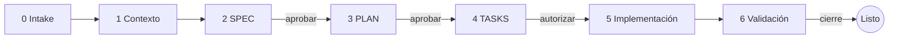

# Spec-Driven Mobile Development (SDMD)

[](LICENSE)
[](https://github.com/omarSanOc/spec-driven-mobile-development/actions/workflows/validate.yml)


[English](README.md) · **Español**

Una [Agent Skill](https://agentskills.io) que hace que tu agente de IA trabaje
como un ingeniero móvil cuidadoso: le das **solo los requerimientos nuevos**, y
él descubre tu arquitectura, escribe una SPEC, un PLAN y TASKS que apruebas una
por una, y solo entonces implementa, con evidencia **por plataforma**.



## Por qué

Los agentes de IA escriben código móvil rápido, pero fallan justo en lo que lo
rompe en producción: la muerte del proceso, la navegación hacia atrás, el
teclado tapando un botón, un doble toque que envía dos pagos, o suponer que si
funciona en Android también funciona en iOS. SDMD pone esas preguntas frente a
ti **antes** de que exista código, y no da nada por terminado sin pruebas.

- **Nada de código sin tu autorización.** Aprobar un documento no es autorizar la implementación.
- **Nada inventado.** Cada afirmación es *verificada* (con ruta de archivo), *confirmada* por ti, *propuesta* o *PENDIENTE*.
- **Checklist móvil integrado.** Ciclo de vida, restauración de estado, conectividad, back, teclado, insets, modo oscuro, accesibilidad, permisos, privacidad: cada punto se decide o se marca N/A con su razón.
- **Evidencia por plataforma.** Un build verde en Android no prueba nada de iOS. Lo que no se puede ejecutar se reporta como **BLOCKED**, nunca como aprobado.
- **Tu proyecto manda.** Lee tu `AGENTS.md`, tus plantillas y guías, y se adapta a GitHub Spec Kit, Kiro u OpenSpec si ya los usas.
- **Proporcional.** Un *track lite* (un documento, dos aprobaciones) para features pequeñas.

## Tecnologías soportadas

| Tecnología | Detección | Referencia |
| --- | --- | --- |
| Android nativo (Kotlin/Java, Compose o Views) | Gradle + `com.android.application` | [`android.md`](skills/spec-driven-mobile-development/references/platforms/android.md) |
| iOS nativo (Swift/Objective-C, SwiftUI o UIKit) | `.xcodeproj`, `Package.swift`, Tuist, XcodeGen | [`ios.md`](skills/spec-driven-mobile-development/references/platforms/ios.md) |
| Kotlin Multiplatform (Compose MP o UIs nativas) | Plugin `multiplatform` de Kotlin | [`kmp.md`](skills/spec-driven-mobile-development/references/platforms/kmp.md) |
| Flutter | `pubspec.yaml` con el SDK de Flutter | [`flutter.md`](skills/spec-driven-mobile-development/references/platforms/flutter.md) |
| React Native (bare o Expo) | `package.json` con `react-native` / `expo` | [`react-native.md`](skills/spec-driven-mobile-development/references/platforms/react-native.md) |

Otras tecnologías (.NET MAUI, Capacitor, NativeScript…) funcionan con las guías
móviles genéricas: el agente te avisa que no hay archivo de plataforma y toma
todos los comandos de tu repositorio. [Se aceptan contribuciones](CONTRIBUTING.md).

Las apps de una sola plataforma tienen soporte completo: cada fila por
plataforma usa solo las plataformas en las que tu app se publica.

## Instalación

**Cualquier agente (Claude Code, Codex, Copilot, Cursor, Gemini CLI y más):**

```bash
npx skills add omarSanOc/spec-driven-mobile-development
```

**Plugin de Claude Code:**

```
/plugin marketplace add omarSanOc/spec-driven-mobile-development
/plugin install spec-driven-mobile-development@sdmd
```

**Manual:** copia `skills/spec-driven-mobile-development/` en tu repo dentro de
`.agents/skills/` (lo leen Codex, Gemini CLI y VS Code/Copilot) o
`.claude/skills/` (Claude Code). En [INSTALL.md](INSTALL.md) está el detalle por
agente, instalación personal vs. por proyecto, y agentes sin soporte de skills.

## Uso

Pásale solo los requerimientos nuevos, en cualquier idioma:

```
Usa spec-driven-mobile-development con estos requerimientos:
[Req 1] Los usuarios que olvidaron su contraseña deben poder pedir un correo de recuperación desde el login.
[Req 2] Mostrar errores claros cuando algo falle.
```

Los requerimientos también pueden ser links a un ticket de Jira/Linear, un
issue de GitHub o un frame de Figma, si tu agente puede abrirlos.

En cada turno el agente responde con una línea de estado y como máximo tres
preguntas:

```
SDMD · forgot-password · full · Stage 2 SPEC · SPEC.md Draft
```

Los documentos se guardan en `docs/features/<feature>/` (o en la convención que
ya tenga tu proyecto):

```
docs/features/
├── PROJECT_CONTEXT.md      # opcional, lo reutilizan todas las features
└── forgot-password/
    ├── SPEC.md             # qué y por qué: FR, AC, comportamiento móvil, decisiones
    ├── PLAN.md             # cómo: rutas verificadas, mecanismos, estrategia de validación
    └── TASKS.md            # tareas pequeñas verificables + tabla de validación por plataforma
```

Para retomar después, pídele al agente que continúe la feature: lee el estado
de los documentos y sigue donde te quedaste.

## Ejemplo completo

[`examples/flutter-forgot-password/`](examples/flutter-forgot-password/): una
app Flutter ficticia llevada por todas las etapas, incluida una verificación
reportada como BLOCKED (el ejemplo está en inglés).

## FAQ

**¿Funciona sin macOS?** Sí. Los builds de iOS y las pruebas en simulador
quedan como BLOCKED, con la verificación exacta que falta.

**¿No es demasiado para un cambio pequeño?** Usa el track lite, o no uses la
skill para arreglos de una línea: no está pensada para eso.

**Mi equipo ya escribe specs en otro formato.** Tus plantillas, IDs y carpetas
tienen prioridad sobre los valores por defecto de la skill.

**¿Puede correr sin nadie presente (desde un issue o CI)?** Se detiene después
de escribir el borrador de la SPEC con sus preguntas abiertas; nunca toma el
silencio como aprobación.

## Licencia

[Apache 2.0](LICENSE) © Omar Sánchez
