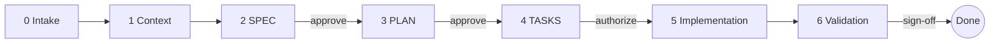

# Spec-Driven Mobile Development (SDMD)

[](LICENSE)


**English** · [Español](README.es.md)

An [Agent Skill](https://agentskills.io) that makes your AI coding agent work like
a careful mobile engineer: you hand it **only the new requirements**, and it
discovers your architecture, writes a SPEC, a PLAN and TASKS you approve one by
one, and only then implements — with evidence **per platform**.



## Why

AI agents are fast at writing mobile code and bad at the things that break it
in production: process death, back navigation, the keyboard covering a button,
a double tap sending two payments, "works on Android" assumed for iOS. SDMD
puts those questions in front of you **before** any code exists, and refuses to
call something done without proof.

- **No code before you authorize it.** Approving a document is not authorizing implementation.
- **Nothing invented.** Every statement is *verified* (with a file path), *confirmed* by you, *proposed*, or *PENDING*.
- **Mobile checklist built in.** Lifecycle, state restoration, connectivity, back, keyboard, insets, dark mode, accessibility, permissions, privacy — each one decided or marked N/A with a reason.
- **Evidence per platform.** A green Android build proves nothing about iOS. Checks that cannot run are reported as **BLOCKED**, never as passed.
- **Your project wins.** It reads your `AGENTS.md`, templates and guidelines, and adapts to GitHub Spec Kit, Kiro or OpenSpec if you already use them.
- **Proportional.** A *lite track* (one document, two approvals) for small features.

## Supported technologies

| Technology | Detection | Reference |
| --- | --- | --- |
| Android native (Kotlin/Java, Compose or Views) | Gradle + `com.android.application` | [`android.md`](skills/spec-driven-mobile-development/references/platforms/android.md) |
| iOS native (Swift/Objective-C, SwiftUI or UIKit) | `.xcodeproj`, `Package.swift`, Tuist, XcodeGen | [`ios.md`](skills/spec-driven-mobile-development/references/platforms/ios.md) |
| Kotlin Multiplatform (Compose MP or native UIs) | Kotlin `multiplatform` plugin | [`kmp.md`](skills/spec-driven-mobile-development/references/platforms/kmp.md) |
| Flutter | `pubspec.yaml` with the Flutter SDK | [`flutter.md`](skills/spec-driven-mobile-development/references/platforms/flutter.md) |
| React Native (bare or Expo) | `package.json` with `react-native` / `expo` | [`react-native.md`](skills/spec-driven-mobile-development/references/platforms/react-native.md) |

Other technologies (.NET MAUI, Capacitor, NativeScript…) still work with the
generic mobile guidelines; the agent tells you there is no platform file and
takes every command from your repository. [Contributions welcome](CONTRIBUTING.md).

Apps that ship on a single platform are first-class: every per-platform row
uses only the platforms your app actually ships on.

## Install

**Any agent (Claude Code, Codex, Copilot, Cursor, Gemini CLI, and more):**

```bash
npx skills add omarSanOc/spec-driven-mobile-development
```

**Claude Code plugin:**

```
/plugin marketplace add omarSanOc/spec-driven-mobile-development
/plugin install spec-driven-mobile-development@sdmd
```

**Manual:** copy `skills/spec-driven-mobile-development/` into your repo at
`.agents/skills/` (read by Codex, Gemini CLI and VS Code/Copilot) or
`.claude/skills/` (Claude Code). See [INSTALL.md](INSTALL.md) for every agent,
personal vs. project installs, and agents without skill support.

## Use

Give it only the new requirements, in any language:

```
Use spec-driven-mobile-development with these requirements:
[Req 1] Users who forgot their password must be able to request a reset email from the login screen.
[Req 2] Show clear errors when something fails.
```

Requirements can also be links to a Jira/Linear ticket, a GitHub issue or a
Figma frame if your agent can open them.

The agent answers every turn with a status line and at most three questions:

```
SDMD · forgot-password · full · Stage 2 SPEC · SPEC.md Draft
```

Documents land in `docs/features/<feature>/` (or your project's existing
convention):

```
docs/features/
├── PROJECT_CONTEXT.md      # optional, reused by every feature
└── forgot-password/
    ├── SPEC.md             # what and why — FR, AC, mobile behavior, decisions
    ├── PLAN.md             # how — verified paths, mechanisms, validation strategy
    └── TASKS.md            # small verifiable tasks + per-platform validation table
```

To resume later, just ask the agent to continue the feature; it reads the
documents' status and picks up where you left off.

## See a full example

[`examples/flutter-forgot-password/`](examples/flutter-forgot-password/) — a
fictional Flutter app taken through every stage, including a check reported as
BLOCKED.

## Repository layout

```
.
├── skills/spec-driven-mobile-development/
│   ├── SKILL.md                     # the workflow the agent follows
│   └── references/
│       ├── mobile-guidelines.md     # checklist + mobile behavior table
│       ├── evidence-rules.md        # what counts as proof
│       ├── spec-template.md · plan-template.md · tasks-template.md
│       ├── lite-template.md         # small features
│       ├── project-context-template.md
│       └── platforms/               # android · ios · kmp · flutter · react-native · _template
├── examples/
├── .claude-plugin/                  # Claude Code plugin + marketplace manifest
├── INSTALL.md · CONTRIBUTING.md · CHANGELOG.md · LICENSE
```

## FAQ

**Does it work without macOS?** Yes. iOS builds and simulator checks are
recorded as BLOCKED with the exact check still needed.

**Is it too heavy for a small change?** Use the lite track, or skip the skill
for one-line fixes — it is not meant for those.

**My team already writes specs in another format.** Your templates, IDs and
folders win over the skill's defaults.

**Can it run unattended (from an issue or CI)?** It stops after writing the
SPEC draft with its open questions; it never treats silence as approval.

## License

[Apache 2.0](LICENSE) © Omar Sánchez
